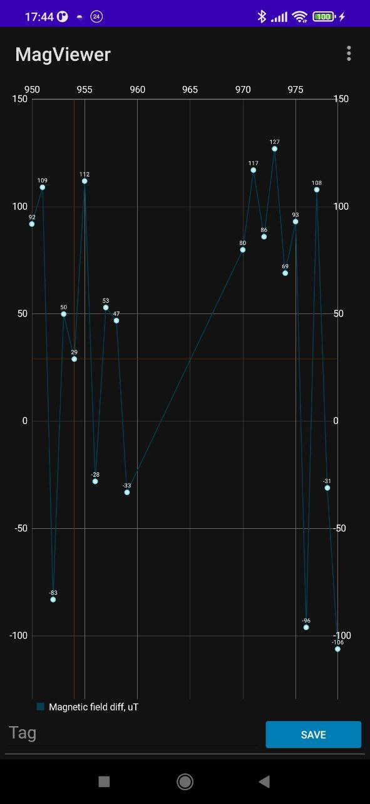

# Magnetic sensor data Android viewer

ESP32 or Pi Pico board serves as a TCP server, Android - as a TCP client.

Server sends magnetic field data, Android displays it.

## Menu options

### Connection

Specify TCP server IP address and port number

### Data protocol

Specify data type (`int8_t`, `int_16_t`, `int32_t`, `float`) and endianness (big/little).

## Screenshots

